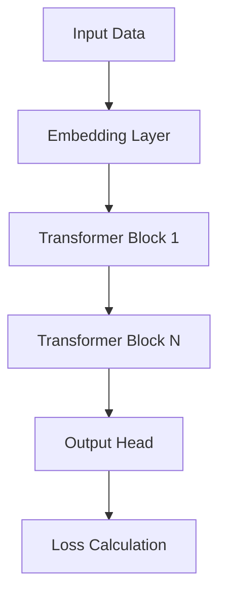

# 🤖 Model Architecture

**Purpose:** Defines the core architecture, loss functions, and optimization strategies for the ML models being developed.

## Core Model Concept
- **Architecture Type:** [e.g., Transformer, CNN, XGBoost]
- **Framework:** [e.g., PyTorch, TensorFlow, JAX]
- **Pre-trained Weights:** [e.g., None, BERT-base, ResNet50]

## Architecture Details

## Hyperparameters (Baseline)
- **Learning Rate:** [e.g., 3e-4]
- **Batch Size:** [e.g., 32]
- **Optimizer:** [e.g., AdamW]
- **Loss Function:** [e.g., CrossEntropyLoss]

## Related Context
- Trained on data from: [[1_Dataset_Registry]]
- Track iterations in: [[3_Experiment_Tracker]]
- Integrates into the main app via: [[System Architecture]]
